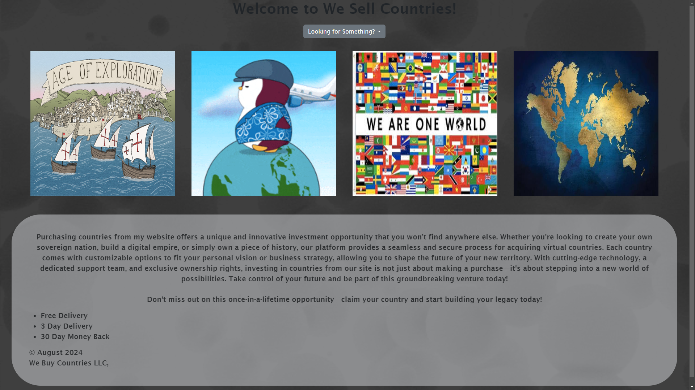
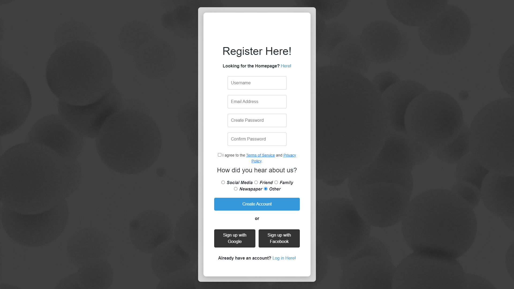
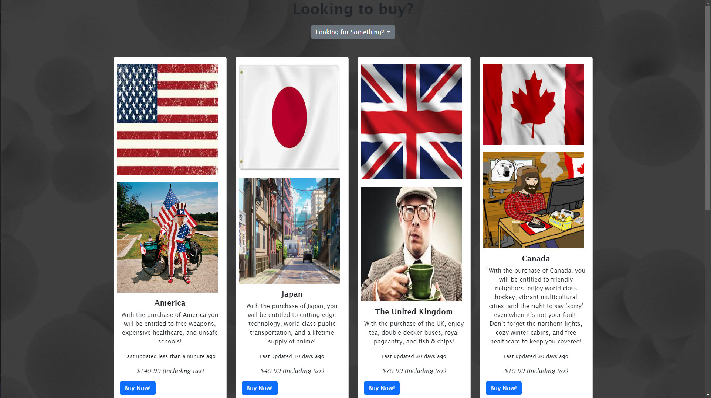
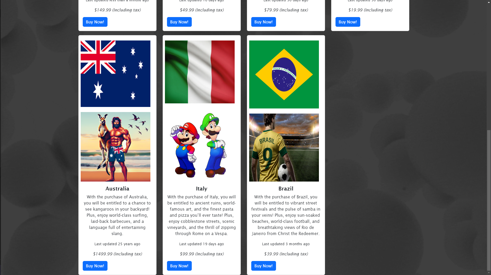

# Capstone Project

## Overview

Welcome to the Capstone Project website! This project serves as a portfolio showcasing the skills and knowledge I have acquired throughout my journey in web development. The site features various sections, including project highlights, a product page, and testimonials from notable figures.

## Screenshots

## Features

- **Responsive Design**: The website is optimized for both desktop and mobile devices, ensuring a seamless user experience.
- **Interactive Elements**: Engage with different components, including product displays and user testimonials.
- **Clear Navigation**: Easily explore the website's content with a user-friendly navigation menu.
- **Moving Background**: The overall website has a moving background for all pages. 

## Technologies Used

- W3Schools
- Bootstrap
- HTML5
- CSS3
- JavaScript
- GitHub Pages for hosting

## Getting Started

To view the website, simply click the link below:

[Visit Capstone Project](https://jbatts.github.io/Capstone/)

## Usage

Feel free to explore the different sections of the website. You can check out the product page for details on available products, read testimonials, and learn more about the projects showcased.

## Contributing

If you'd like to contribute to the project or provide feedback, please reach out via my [LinkedIn profile](https://www.linkedin.com/in/jalen-battle-551185164/) or submit an issue on the GitHub repository.

## License

This project is open-source and available under the MIT License. Feel free to use, modify, and distribute it as needed.

## Acknowledgments

Special thanks to everyone who supported me throughout this project, including mentors, peers, and online resources that have contributed to my learning journey.
